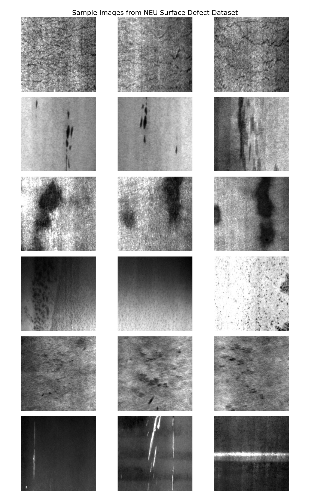
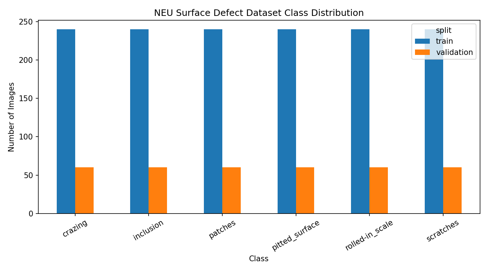
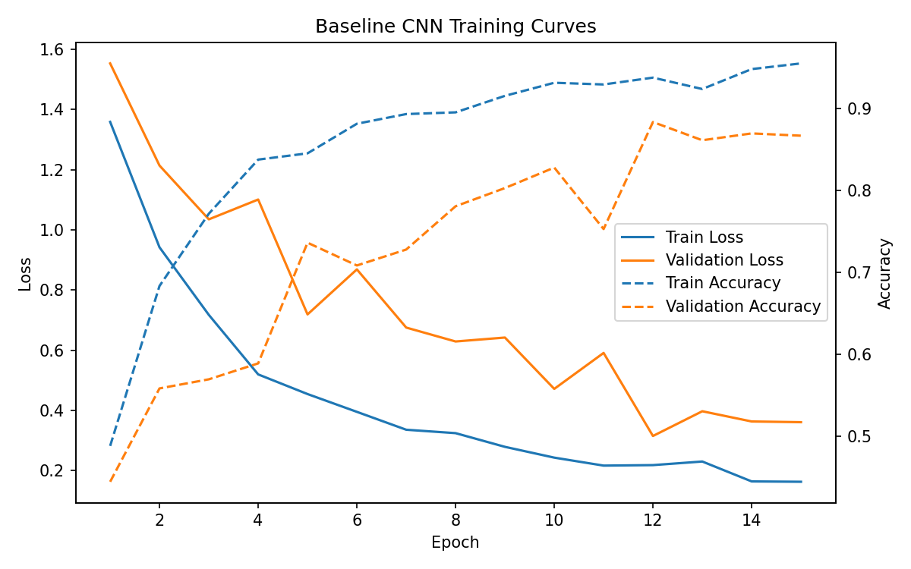
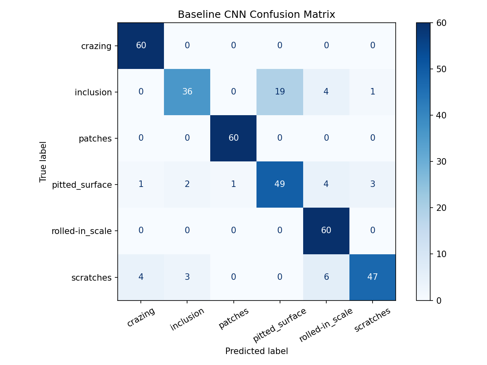
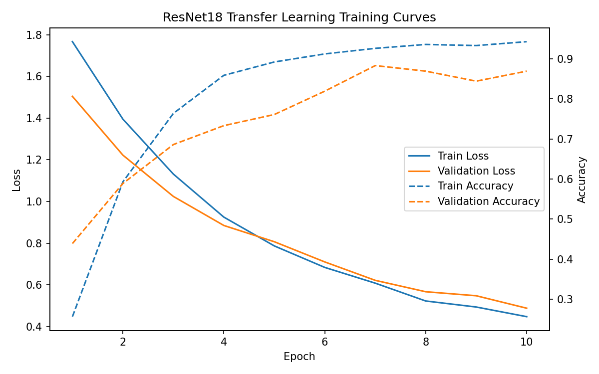
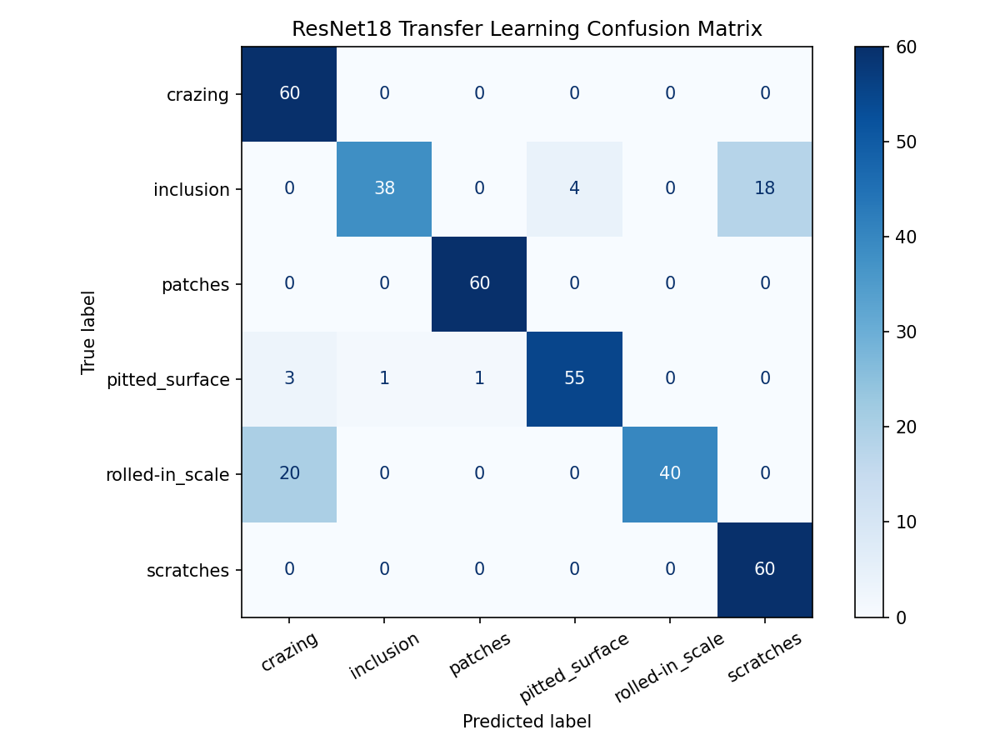

# Industrial Surface Defect Classification

Computer vision project for classifying industrial surface defects using deep learning and transfer learning.

This repository is an AI-focused portfolio project for automated visual inspection in industrial environments. It uses a real industrial surface defect image dataset and builds a PyTorch-based image classification pipeline.

The project demonstrates:

- computer vision
- image classification
- industrial defect inspection
- baseline CNN modeling
- transfer learning with ResNet18
- model evaluation and visualization
- practical deep learning workflow with PyTorch

---

## Project Overview

Industrial surface defects can appear in manufacturing processes such as steel production, rolling, machining, coating, and visual quality inspection.

The goal of this project is to classify surface defect images into multiple defect categories using deep learning.

The current workflow is:

```text
NEU-DET surface defect dataset
→ dataset inspection
→ sample visualization
→ baseline CNN training
→ ResNet18 transfer learning
→ training curve visualization
→ confusion matrix evaluation
```

---

## Motivation

Visual inspection is an important part of industrial monitoring and quality control.

Manual inspection can be slow, inconsistent, and difficult to scale. Computer vision models can support automated defect recognition by learning visual patterns from image data.

This project is designed as a pure AI / computer vision project while still staying close to engineering and intelligent monitoring systems.

It complements my other portfolio projects in:

- embedded AI
- sensor-based condition monitoring
- vibration-based fault diagnosis
- IoT digital twin systems
- dynamic system modeling
- state estimation and Kalman filtering

---

## Dataset

This project uses the **NEU Surface Defect Dataset (NEU-DET)**.

The dataset contains grayscale surface defect images from industrial steel surfaces.

The six defect classes are:

- `crazing`
- `inclusion`
- `patches`
- `pitted_surface`
- `rolled-in_scale`
- `scratches`

Current dataset split:

| Split | Images |
|---|---:|
| Train | 1440 |
| Validation | 360 |
| Total | 1800 |

Each class is balanced:

| Split | Images per class |
|---|---:|
| Train | 240 |
| Validation | 60 |

Raw dataset files are stored locally under:

```text
data/raw/
```

Raw dataset files are not tracked in Git.

---

## Dataset Visualization

### Sample Defect Images



### Class Distribution



---

## Methods

The project currently compares two deep learning approaches.

### 1. Baseline CNN

A custom convolutional neural network trained from scratch.

Main characteristics:

- grayscale input
- image size: `128 × 128`
- 3 convolution blocks
- max pooling
- dropout
- fully connected classifier
- trained directly on the NEU-DET training split

Training script:

```text
src/train_baseline_cnn.py
```

### 2. ResNet18 Transfer Learning

A pretrained ResNet18 model is used as a transfer learning baseline.

Main characteristics:

- pretrained ResNet18 backbone
- grayscale images converted to 3-channel input
- image size: `224 × 224`
- frozen feature extractor
- replaced final classification layer for 6 defect classes
- trained only the final layer

Training script:

```text
src/train_resnet18.py
```

---

## Results

### Model Comparison

| Model | Best Validation Accuracy | Notes |
|---|---:|---|
| Baseline CNN | 0.8833 | Custom CNN trained from scratch |
| ResNet18 Transfer Learning | 0.8833 | Pretrained ResNet18 with frozen feature extractor |

Both models achieved similar validation accuracy on the current dataset split.

The baseline CNN already performs reasonably well, while the ResNet18 transfer learning model provides a strong reference point for future improvements such as partial fine-tuning, stronger augmentation, and Grad-CAM visualization.

---

## Baseline CNN Results

### Training Curves



### Confusion Matrix



Baseline CNN final validation summary:

| Metric | Value |
|---|---:|
| Best validation accuracy | 0.8833 |
| Final validation accuracy | about 0.87 |
| Macro F1-score | about 0.86 |

The baseline CNN performs strongly on classes such as `crazing`, `patches`, and `rolled-in_scale`, while `inclusion` and `pitted_surface` are more challenging.

---

## ResNet18 Transfer Learning Results

### Training Curves



### Confusion Matrix



ResNet18 final validation summary:

| Metric | Value |
|---|---:|
| Best validation accuracy | 0.8833 |
| Final validation accuracy | about 0.87 |
| Macro F1-score | about 0.87 |

The ResNet18 model improves precision for some classes, such as `inclusion` and `pitted_surface`, but still shows class-level tradeoffs. This suggests that future work should focus on fine-tuning, augmentation, and better model interpretation.

---

## Repository Structure

```text
industrial-surface-defect-classification/
├── data/
│   ├── raw/
│   └── processed/
├── docs/
├── models/
├── results/
│   ├── baseline_cnn_confusion_matrix.png
│   ├── baseline_cnn_training_curves.png
│   ├── dataset_class_distribution.csv
│   ├── dataset_class_distribution.png
│   ├── resnet18_confusion_matrix.png
│   ├── resnet18_training_curves.png
│   └── sample_defect_images.png
├── src/
│   ├── inspect_dataset.py
│   ├── train_baseline_cnn.py
│   └── train_resnet18.py
├── .gitignore
├── README.md
└── requirements.txt
```

---

## Main Files

Important files currently included in the project:

- `src/inspect_dataset.py`  
  Inspects the dataset, exports class distribution, and creates sample image visualizations.

- `src/train_baseline_cnn.py`  
  Trains a custom baseline CNN model and generates training curves and a confusion matrix.

- `src/train_resnet18.py`  
  Trains a ResNet18 transfer learning baseline using a frozen pretrained feature extractor.

- `results/sample_defect_images.png`  
  Grid of sample images from each defect class.

- `results/dataset_class_distribution.png`  
  Visualization of train and validation class counts.

- `results/baseline_cnn_training_curves.png`  
  Training and validation curves for the baseline CNN.

- `results/baseline_cnn_confusion_matrix.png`  
  Confusion matrix for the baseline CNN.

- `results/resnet18_training_curves.png`  
  Training and validation curves for ResNet18 transfer learning.

- `results/resnet18_confusion_matrix.png`  
  Confusion matrix for ResNet18 transfer learning.

---

## How to Run

### 1. Create and activate a virtual environment

```bash
python3 -m venv venv
source venv/bin/activate
```

### 2. Install dependencies

```bash
pip install -r requirements.txt
```

### 3. Inspect the dataset

```bash
python src/inspect_dataset.py
```

### 4. Train the baseline CNN

```bash
python src/train_baseline_cnn.py
```

### 5. Train the ResNet18 transfer learning model

```bash
python src/train_resnet18.py
```

---

## Dependencies

Main libraries:

- `torch`
- `torchvision`
- `numpy`
- `pandas`
- `matplotlib`
- `scikit-learn`
- `pillow`
- `tqdm`

Additional libraries prepared for future stages:

- `opencv-python`
- `albumentations`
- `scikit-image`
- `timm`
- `torchmetrics`
- `grad-cam`

---

## Project Role in Portfolio

This project adds a visually strong AI / computer vision project to my portfolio.

It complements projects focused on:

- sensor-based embedded AI
- real vibration fault diagnosis
- IoT and digital twin systems
- dynamic system simulation
- state estimation and Kalman filtering

The project demonstrates that I can work not only with sensor and time-series data, but also with image-based deep learning and transfer learning.

---

## Limitations

Current limitations:

- only classification is performed, even though annotation files are available
- raw dataset files are not included in the repository
- the current ResNet18 model uses a frozen feature extractor
- no full fine-tuning has been performed yet
- no Grad-CAM or visual explanation has been added yet
- results are based on the provided train/validation split

---

## Future Work

Planned extensions:

- add model comparison CSV
- add prediction examples
- add Grad-CAM visual explanations
- fine-tune deeper ResNet18 layers
- compare MobileNetV2 or EfficientNet
- improve data augmentation
- use detection annotations for localization-oriented experiments
- add error analysis for difficult classes such as `inclusion`

---

## Summary

This project demonstrates industrial surface defect classification using computer vision and deep learning.

It includes dataset inspection, visual exploration, a custom baseline CNN, and a ResNet18 transfer learning baseline. The project is designed to be visually clear, practical, and suitable for GitHub portfolio presentation.
