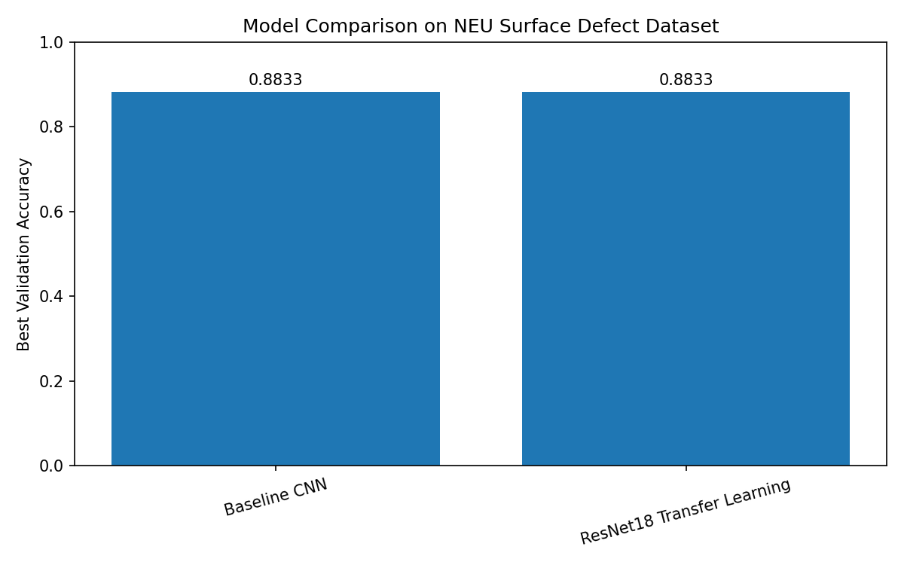
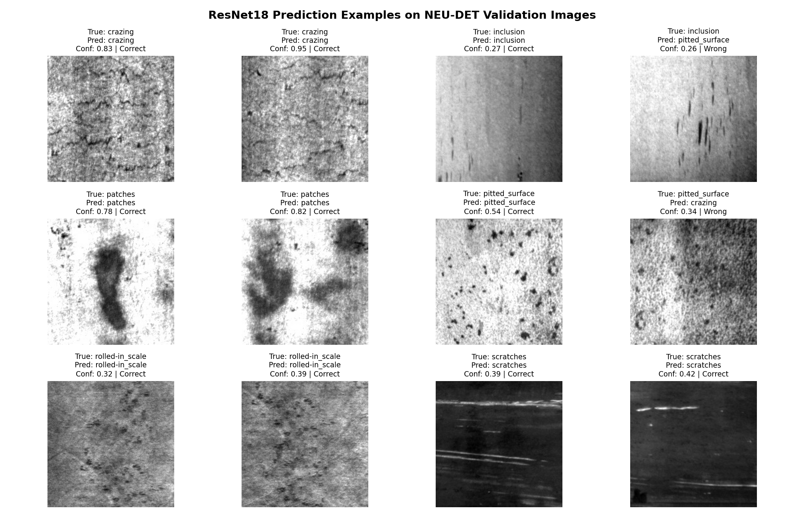
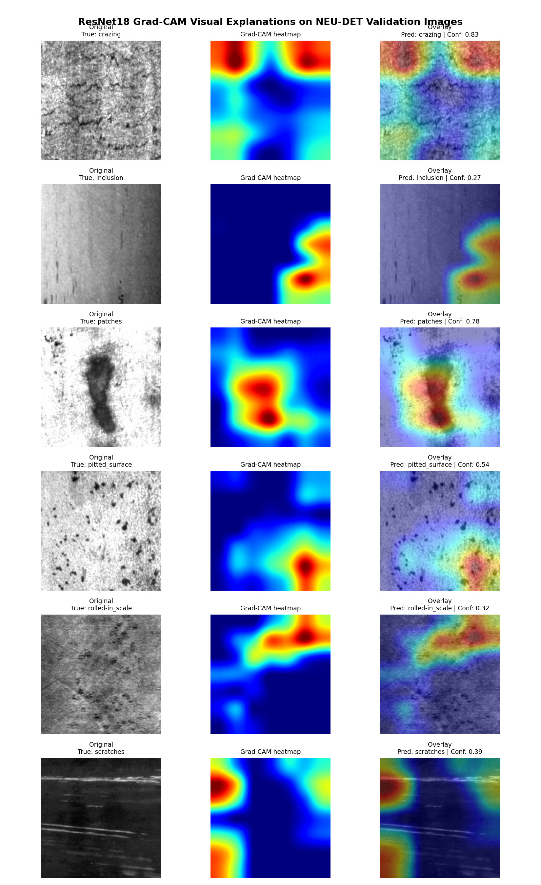

# Industrial Surface Defect Classification

I built this as a supporting computer vision project for industrial visual inspection. It uses the NEU-DET steel surface defect dataset, compares a small baseline CNN with a frozen ResNet18 transfer-learning model, and adds prediction examples plus Grad-CAM visual explanations.

The most useful part of the current version is that the result is not perfect: both models stay around 0.87 validation accuracy, and some classes such as `inclusion` and `pitted_surface` remain harder. That makes the project more useful for error analysis than a clean-looking but unrealistic 100% result.

Current workflow:

- inspect the NEU-DET dataset
- visualize sample defect images and class balance
- train a baseline CNN from scratch
- train a frozen ResNet18 transfer-learning baseline
- compare validation performance
- inspect prediction examples
- generate Grad-CAM explanations for selected validation images

---

## Overview

Industrial surface defects can occur during manufacturing processes such as steel production, rolling, machining, coating, and visual quality inspection.

The goal of this project is to classify surface defect images into six defect categories using deep learning models.

The current workflow is:

```text
NEU-DET surface defect dataset
→ dataset inspection
→ sample visualization
→ baseline CNN training
→ ResNet18 transfer learning
→ training curve visualization
→ confusion matrix evaluation
→ prediction example visualization
→ Grad-CAM visual explanation
→ model comparison
```

---

## What this version shows

This version is a validation-split image classification baseline, not a production inspection system.

The baseline CNN and frozen ResNet18 model reach similar validation performance. That is useful because it shows that transfer learning is not automatically better unless the feature extractor is fine-tuned, the augmentation strategy is improved, or more failure-case analysis is done.

Grad-CAM is included as a qualitative inspection tool. It helps check whether the ResNet18 model is looking at visually meaningful regions, but it should not be treated as a full explanation of model reliability.

---

## Dataset

This project uses the **NEU Surface Defect Dataset (NEU-DET)**.

The dataset contains grayscale images of industrial steel surface defects.

The six defect classes are:

- `crazing`
- `inclusion`
- `patches`
- `pitted_surface`
- `rolled-in_scale`
- `scratches`

Current dataset split:

| Split | Images |
|---|---:|
| Train | 1440 |
| Validation | 360 |
| Total | 1800 |

Each class is balanced:

| Split | Images per class |
|---|---:|
| Train | 240 |
| Validation | 60 |

Raw dataset files are stored locally under:

```text
data/raw/
```

Raw dataset files are not tracked in Git.

---

## Dataset Visualization

### Sample Defect Images


### Class Distribution


---

## Methods

This project currently compares two deep learning approaches.

### 1. Baseline CNN

A custom convolutional neural network trained from scratch.

Main characteristics:

- grayscale input
- image size: `128 × 128`
- 3 convolution blocks
- max pooling
- dropout
- fully connected classifier
- trained directly on the NEU-DET training split

Training script:

```text
src/train_baseline_cnn.py
```

### 2. ResNet18 Transfer Learning

A pretrained ResNet18 model is used as a transfer learning baseline.

Main characteristics:

- pretrained ResNet18 backbone
- grayscale images converted to 3-channel input
- image size: `224 × 224`
- frozen feature extractor
- replaced final classification layer for 6 defect classes
- trained only the final classification layer

Training script:

```text
src/train_resnet18.py
```

### 3. Grad-CAM Explainability

Grad-CAM is used to visualize which image regions contribute most strongly to the ResNet18 prediction.

This adds an explainability layer to the classification pipeline and helps inspect whether the model focuses on visually meaningful defect regions.

Grad-CAM script:

```text
src/create_gradcam_examples.py
```

---

## Results

### Model Comparison



| Model | Best Validation Accuracy | Final Validation Accuracy | Macro F1-score | Notes |
|---|---:|---:|---:|---|
| Baseline CNN | 0.8833 | about 0.87 | about 0.86 | Custom CNN trained from scratch |
| ResNet18 Transfer Learning | 0.8833 | about 0.87 | about 0.87 | Frozen pretrained ResNet18 feature extractor |

Both models achieved similar validation accuracy on the current validation split.

The baseline CNN performs competitively despite being trained from scratch, while ResNet18 transfer learning provides a strong reference point for future improvements such as partial fine-tuning, stronger data augmentation, and deeper visual explainability.

Official comparison outputs:

```text
results/model_comparison.csv
results/model_comparison.png
```

---

## Baseline CNN Results

### Training Curves


### Confusion Matrix


Baseline CNN validation summary:

| Metric | Value |
|---|---:|
| Best validation accuracy | 0.8833 |
| Final validation accuracy | about 0.87 |
| Macro F1-score | about 0.86 |

The baseline CNN performs strongly on classes such as `crazing`, `patches`, and `rolled-in_scale`, while `inclusion` and `pitted_surface` are more challenging.

---

## ResNet18 Transfer Learning Results

### Training Curves


### Confusion Matrix


ResNet18 validation summary:

| Metric | Value |
|---|---:|
| Best validation accuracy | 0.8833 |
| Final validation accuracy | about 0.87 |
| Macro F1-score | about 0.87 |

The ResNet18 model improves some class-level metrics, especially for classes such as `inclusion` and `pitted_surface`, but still shows tradeoffs between defect categories. This suggests that future work should focus on fine-tuning, augmentation, and more detailed failure-case analysis.

---

## Prediction Examples

### ResNet18 Validation Predictions



This figure shows example predictions from the trained ResNet18 model on validation images.

It helps visualize both:

- correctly classified defect images
- misclassified examples
- model confidence on individual samples

This makes the project more interpretable and provides a more concrete view of model behavior beyond aggregate metrics such as accuracy and macro F1-score.

Prediction visualization script:

```text
src/create_prediction_examples.py
```

Output:

```text
results/prediction_examples_resnet18.png
```

---

## Grad-CAM Visual Explanations

### ResNet18 Grad-CAM Examples



This figure shows Grad-CAM visual explanations for example validation images from the trained ResNet18 model.

Grad-CAM highlights image regions that contribute most strongly to the model's prediction. This makes the project more interpretable and provides insight into how the model focuses on different surface defect patterns.

This visualization is useful for:

- understanding model attention
- improving interpretability
- analyzing correct and uncertain predictions
- inspecting whether the model focuses on meaningful defect regions
- making the project more explainable beyond standard classification metrics

Grad-CAM visualization script:

```text
src/create_gradcam_examples.py
```

Output:

```text
results/gradcam_resnet18_examples.png
```

---

## Repository Structure

```text
industrial-surface-defect-classification/
├── data/
│   └── raw/
├── models/
├── results/
│   ├── baseline_cnn_confusion_matrix.png
│   ├── baseline_cnn_training_curves.png
│   ├── dataset_class_distribution.csv
│   ├── dataset_class_distribution.png
│   ├── gradcam_resnet18_examples.png
│   ├── model_comparison.csv
│   ├── model_comparison.png
│   ├── prediction_examples_resnet18.png
│   ├── resnet18_confusion_matrix.png
│   ├── resnet18_training_curves.png
│   └── sample_defect_images.png
├── src/
│   ├── create_gradcam_examples.py
│   ├── create_model_comparison.py
│   ├── create_prediction_examples.py
│   ├── inspect_dataset.py
│   ├── train_baseline_cnn.py
│   └── train_resnet18.py
├── .gitignore
├── README.md
└── requirements.txt
```

---

## Main Files

- `src/inspect_dataset.py`  
  Inspects the dataset, exports class distribution results, and creates sample image visualizations.

- `src/train_baseline_cnn.py`  
  Trains a custom baseline CNN and generates training curves and a confusion matrix.

- `src/train_resnet18.py`  
  Trains a ResNet18 transfer learning baseline using a frozen pretrained feature extractor.

- `src/create_model_comparison.py`  
  Creates the model comparison CSV and visualization.

- `src/create_prediction_examples.py`  
  Loads the trained ResNet18 model and creates a grid of validation prediction examples.

- `src/create_gradcam_examples.py`  
  Generates Grad-CAM visual explanations for example validation images using the trained ResNet18 model.

- `results/sample_defect_images.png`  
  Grid of sample images from each defect class.

- `results/dataset_class_distribution.png`  
  Visualization of train and validation class counts.

- `results/baseline_cnn_training_curves.png`  
  Training and validation curves for the baseline CNN.

- `results/baseline_cnn_confusion_matrix.png`  
  Confusion matrix for the baseline CNN.

- `results/resnet18_training_curves.png`  
  Training and validation curves for ResNet18 transfer learning.

- `results/resnet18_confusion_matrix.png`  
  Confusion matrix for ResNet18 transfer learning.

- `results/model_comparison.csv`  
  Tabular comparison of trained models.

- `results/model_comparison.png`  
  Visual comparison of model-level validation performance.

- `results/prediction_examples_resnet18.png`  
  Example validation predictions produced by the ResNet18 model.

- `results/gradcam_resnet18_examples.png`  
  Grad-CAM heatmap and overlay examples showing which image regions influence the ResNet18 predictions.

---

## How to Run

### 1. Create and activate a virtual environment

```bash
python3 -m venv venv
source venv/bin/activate
```

### 2. Install dependencies

```bash
pip install -r requirements.txt
```

### 3. Inspect the dataset

```bash
python src/inspect_dataset.py
```

### 4. Train the baseline CNN

```bash
python src/train_baseline_cnn.py
```

### 5. Train the ResNet18 transfer learning model

```bash
python src/train_resnet18.py
```

### 6. Create model comparison results

```bash
python src/create_model_comparison.py
```

### 7. Create prediction examples

```bash
python src/create_prediction_examples.py
```

### 8. Create Grad-CAM visual explanations

```bash
python src/create_gradcam_examples.py
```

---

## Dependencies

Main libraries:

- `torch`
- `torchvision`
- `numpy`
- `pandas`
- `matplotlib`
- `scikit-learn`
- `pillow`

Additional libraries prepared for future stages:

- `opencv-python`
- `albumentations`
- `scikit-image`
- `timm`
- `torchmetrics`
- `grad-cam`

Note: the current Grad-CAM visualization script uses a lightweight custom implementation with PyTorch hooks and does not require the external `grad-cam` package.

---

## Limitations

Current limitations:

- only classification is performed, even though annotation files are available
- raw dataset files are not included in the repository
- the current ResNet18 model uses a frozen feature extractor
- no full fine-tuning has been performed yet
- Grad-CAM examples are currently limited to a small balanced validation subset
- results are based on the provided train/validation split, not a cross-dataset or production inspection test

---

## Future Work

Planned extensions:

- extend Grad-CAM analysis with more examples and failure-case inspection
- fine-tune deeper ResNet18 layers
- compare MobileNetV2 or EfficientNet
- improve data augmentation
- use detection annotations for localization-oriented experiments
- add error analysis for difficult classes such as `inclusion`

---

## Summary

This project uses computer vision for industrial surface defect classification on NEU-DET images.

The current result is a practical baseline rather than a finished inspection system: a custom CNN and a frozen ResNet18 model both reach about 0.87 validation accuracy, while several defect classes remain harder to separate. The prediction examples and Grad-CAM outputs make those limitations easier to inspect visually.

The next meaningful improvement would be deeper failure-case analysis or fine-tuning, not adding more presentation polish.
