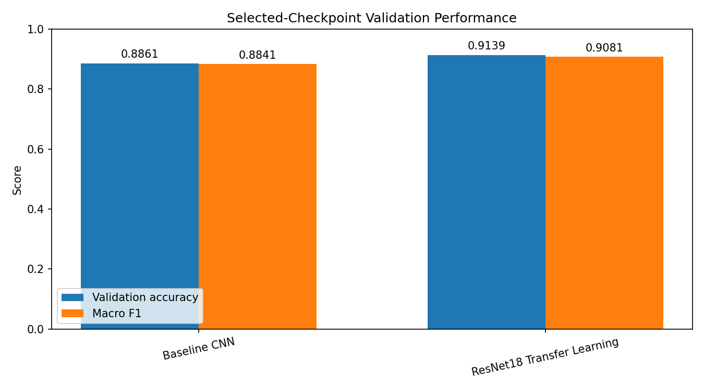
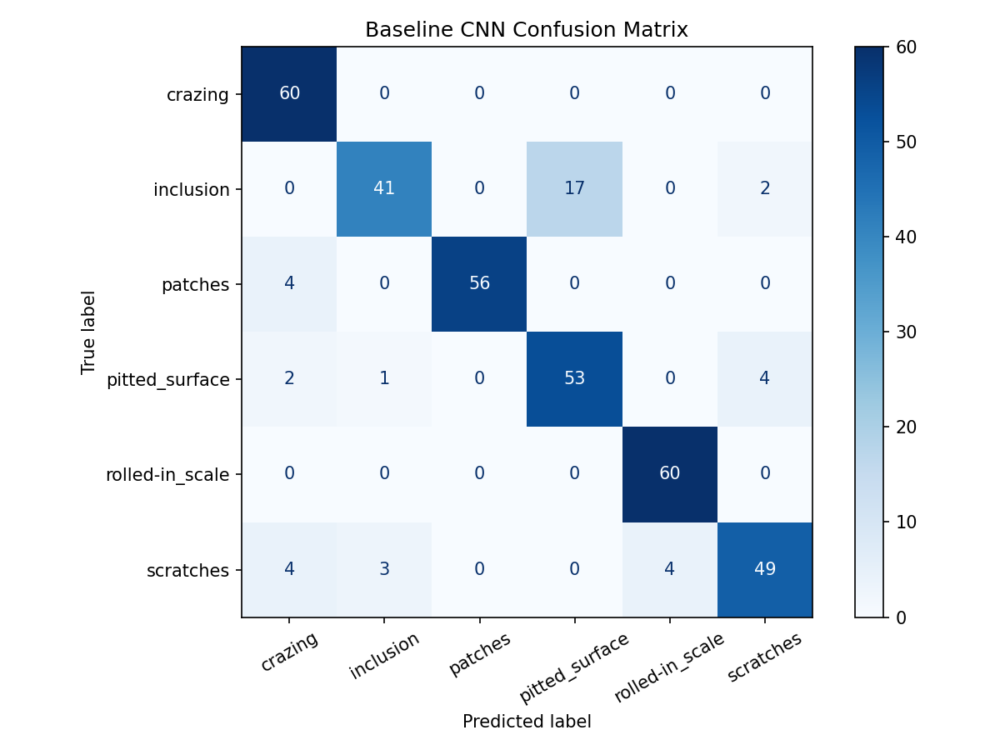
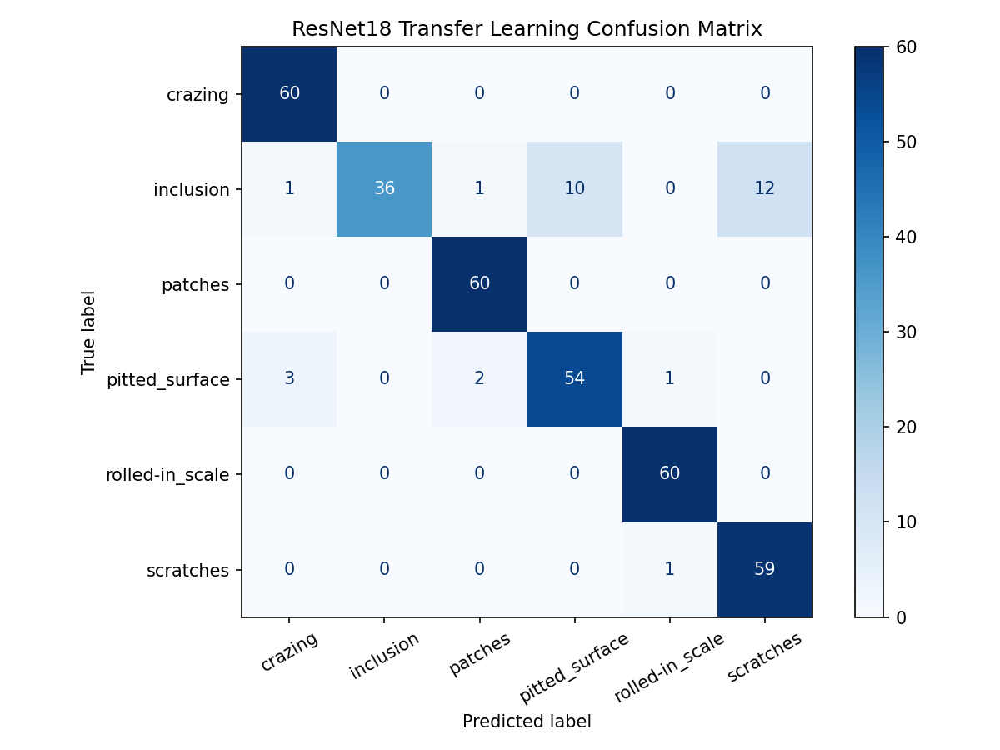
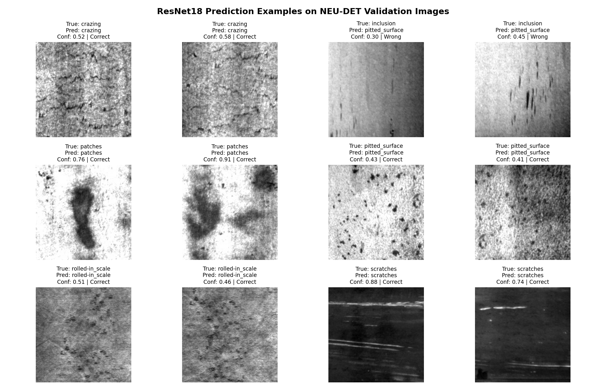
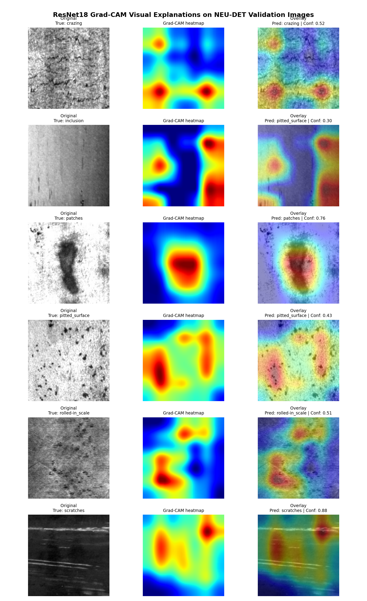

# Industrial Surface Defect Classification

This repository compares a small convolutional neural network with a ResNet18
transfer-learning baseline for classifying six hot-rolled steel surface defects
from the NEU-DET dataset.

In the current recorded run, the baseline CNN reached `0.8861` validation
accuracy and `0.8841` macro F1. The frozen-backbone ResNet18 reached `0.9139`
validation accuracy and `0.9081` macro F1. That is a measurable improvement, but
the class-level report still exposes an important weakness: ResNet18 recall for
`inclusion` is only `0.60`.

| Model | Selected epoch | Validation accuracy | Macro F1 |
|---|---:|---:|---:|
| Baseline CNN | 14 | 0.8861 | 0.8841 |
| ResNet18 transfer learning | 10 | 0.9139 | 0.9081 |



The project is an image-classification baseline for one provided validation
split. It is not a production inspection system, and the reported validation
scores are not independent test-set estimates.

## Dataset and task

The experiments use the
[NEU surface defect database](https://faculty.neu.edu.cn/songkechen/zh_CN/zhym/263269/list/index.htm).
NEU-DET contains 1,800 grayscale images covering six defect classes:

- `crazing`
- `inclusion`
- `patches`
- `pitted_surface`
- `rolled-in_scale`
- `scratches`

This repository uses 240 images per class for training and 60 per class for
validation:

| Split | Images | Images per class |
|---|---:|---:|
| Train | 1,440 | 240 |
| Validation | 360 | 60 |
| Total | 1,800 | 300 |

The raw dataset is not redistributed. Place it locally using this layout:

```text
data/raw/NEU-DET/
├── train/
│   └── images/
│       ├── crazing/
│       ├── inclusion/
│       ├── patches/
│       ├── pitted_surface/
│       ├── rolled-in_scale/
│       └── scratches/
└── validation/
    └── images/
        ├── crazing/
        ├── inclusion/
        ├── patches/
        ├── pitted_surface/
        ├── rolled-in_scale/
        └── scratches/
```

The detection annotations distributed with NEU-DET are not used; the current
task is image-level classification only.

Dataset reference:

> K. Song and Y. Yan, “A noise robust method based on completed local binary
> patterns for hot-rolled steel strip surface defects,” *Applied Surface
> Science*, vol. 285, pp. 858–864, 2013.
> [doi:10.1016/j.apsusc.2013.09.002](https://doi.org/10.1016/j.apsusc.2013.09.002)

## Models

### Baseline CNN

The baseline is trained from scratch on `128 × 128` grayscale images. It uses
three convolution and max-pooling blocks followed by dropout and a two-layer
classifier.

### ResNet18 transfer learning

The transfer-learning model converts each image to three channels, resizes it to
`224 × 224`, and applies ImageNet normalization. ResNet18 backbone weights and
BatchNorm running statistics remain frozen; only the replacement six-class
classification head is optimized.

The pretrained weights are downloaded automatically by torchvision on the first
run.

## Evaluation workflow

Both training scripts use validation accuracy for checkpoint selection. After
training, each script reloads its highest-accuracy checkpoint. The reported
metrics and confusion matrix are generated from that selected model, while the
history table and training curves cover the complete run:

- validation accuracy and macro F1 in a JSON metrics file;
- per-epoch loss and accuracy in a CSV history file;
- a confusion matrix;
- training curves.

`src/create_model_comparison.py` reads those JSON files instead of embedding
result values in source code. Exact values for a regenerated run are stored in:

```text
results/baseline_cnn_metrics.json
results/resnet18_metrics.json
results/model_comparison.csv
```

Because the same validation split is used for checkpoint selection and reporting,
these values should be read as development-set results. A separate untouched
test set or repeated cross-validation would be needed for a stronger estimate of
generalization.

## Visual results

### Confusion matrices





The committed run shows that `inclusion` and `pitted_surface` are frequent sources
of confusion. ResNet18 improves some of those cases but introduces other
tradeoffs, so the transfer-learning baseline is not uniformly better across
classes.

### Prediction examples



The prediction grid uses a small balanced subset of validation images and includes
both correct and incorrect examples. It is qualitative evidence, not an additional
evaluation split.

### Grad-CAM examples



Grad-CAM is used to inspect where the selected ResNet18 checkpoint responds in a
few validation images. The heatmaps can reveal obviously irrelevant attention,
but they do not prove that the model is reliable or causally explained.

## Reproduce the workflow

Create an environment and install the direct dependencies:

```bash
python3 -m venv .venv
source .venv/bin/activate
python -m pip install --upgrade pip
python -m pip install -r requirements.txt
```

After placing the dataset in the expected layout, run:

```bash
python src/inspect_dataset.py
python src/train_baseline_cnn.py
python src/train_resnet18.py
python src/create_model_comparison.py
python src/create_prediction_examples.py
python src/create_gradcam_examples.py
```

The training scripts save checkpoints under `models/`; this directory and the
raw dataset are ignored by Git. Generated tables and figures under `results/`
are the public evidence for the committed experiment.

PyTorch installation can depend on the operating system and accelerator. For a
CUDA-specific setup, use the command generated by the
[official PyTorch installer](https://pytorch.org/get-started/locally/) before
installing the remaining requirements.

## Repository structure

```text
industrial-surface-defect-classification/
├── data/raw/                    # local NEU-DET files; not tracked
├── models/                      # generated checkpoints; not tracked
├── results/                     # committed metrics and visual evidence
├── src/
│   ├── inspect_dataset.py
│   ├── train_baseline_cnn.py
│   ├── train_resnet18.py
│   ├── create_model_comparison.py
│   ├── create_prediction_examples.py
│   └── create_gradcam_examples.py
├── LICENSE
├── README.md
└── requirements.txt
```

## Limitations

- The dataset is small and contains only one steel-surface image domain.
- The validation split is reused for model selection and reporting.
- No untouched test set, repeated split, or cross-dataset evaluation is included.
- Only image-level classification is evaluated; defect localization is not.
- ResNet18 is used as a frozen-backbone baseline rather than a fine-tuned model.
- Grad-CAM covers a small qualitative subset and is not a reliability guarantee.
- Deployment latency, memory use, calibration, and behavior under lighting or
  camera shift have not been measured.

The next meaningful experiment would be an independent evaluation protocol or
controlled partial fine-tuning with the same split and reporting rules—not more
presentation-only output.

## License

The repository code is available under the MIT License. The NEU-DET dataset is
not included and remains subject to its original distribution terms.
